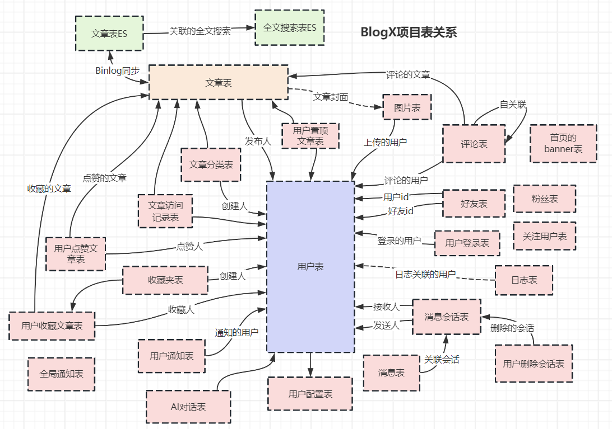

# 🎯 Go-Version-Blog

## 📌 项目介绍

**Go-Version-Blog** 基于 **Go + Vue3** 技术栈打造，集成了现代化的后端与前端架构，提供高效、稳定、可扩展的博客系统。集成了博客项目、社区项目、知识库项目、大模型平台、后台管理系统的所有功能。

## 🚀 技术栈

### 🖥 后端

- **Gin** - 轻量级、高性能的 Go Web 框架
- **GORM** - Go 语言的 ORM 库，简化数据库操作
- **Redis** - 分布式缓存数据库，提升访问速度
- **MySQL** - 关系型数据库，存储核心业务数据
- **WebSocket** - 实现实时通信，增强用户交互体验
- **SSE** - 服务端推送（Server-Sent Events），适用于流式数据更新
- **Elasticsearch** - 分布式搜索引擎，实现高效全文搜索
- **Docker Compose** - 容器编排，简化环境部署

### 🎨 前端

- **Vue 3 + TypeScript** - 现代化前端框架，提升开发体验
- **Arco Design** - 企业级 UI 组件库，提供优雅的 UI 设计

## 🔥 部分细节

### 1️⃣ 使用 WebSocket 实现在线用户即时通讯

- 采用 **WebSocket** 实现长连接，支持 **实时聊天、通知推送**。
- **后端**：使用 `gorilla/websocket` 维护用户连接池，广播消息。
- **前端**：使用 `WebSocket API` 监听和发送消息。

### 2️⃣ MySQL 和 Elasticsearch 数据同步

- **MySQL** 存储博客数据，**Elasticsearch** 提供全文搜索能力。
- 采用 **Binlog + Canal** 监听 **MySQL 数据变更**，并同步到 ES。

### 3️⃣ QQ 登录实现

- 使用 **OAuth 2.0** 进行 **QQ 登录**，获取用户信息。
- **流程**：前端跳转 QQ 授权 → 服务器换取 `Access Token` → 获取用户资料 → JWT 登录。

### 4️⃣ 使用 Docker Compose 便捷部署

- 一键启动 **MySQL、Redis、ES、后端、前端** 等服务。
- 通过 `docker-compose.yml` 管理依赖环境，快速构建可复现的开发环境。

|  |
|:-------------:|
|      表结构      |

## 📷 预览图

🚧 **开发中，敬请期待！** 🚀  